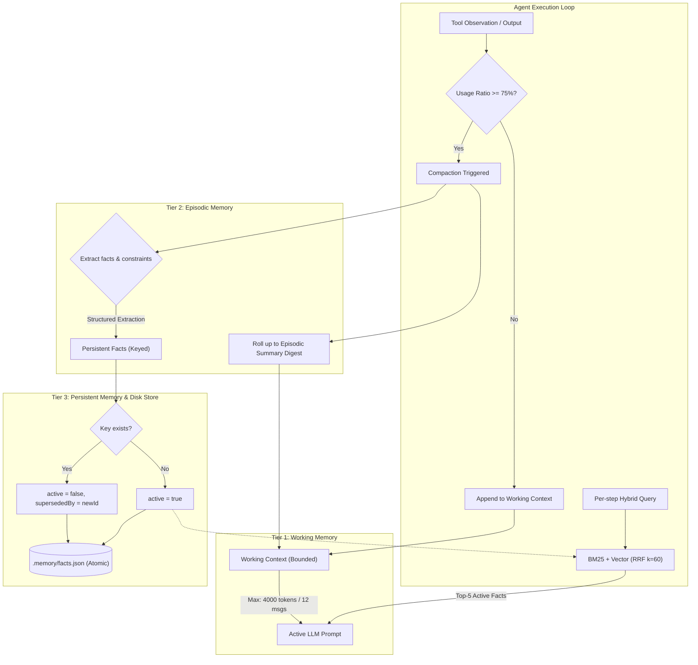

# 🧠 Long-Horizon Memory & Context Engineering Agent (`@task6/memory`)

[](https://www.typescriptlang.org/)
[](https://nodejs.org/)
[](https://vitest.dev/)
[]()
[]()

A durable, bounded-context tiered memory layer for autonomous coding agents. Designed to handle complex multi-file engineering tasks spanning long horizons, deep tool chains, process interruptions, and cold restarts—without token exhaustion, memory pollution, or reliance on expensive cloud vector databases.

---

## 📌 Executive Summary

Autonomous coding agents routinely fail when tasks scale beyond a single context window. Existing solutions either blindly truncate history (destroying addressability) or rely exclusively on LLM summarization (which retains conversational gist while silently stripping verbatim facts such as hostnames, ports, and critical constraints).

This repository implements a **three-tier memory architecture** that guarantees:
1. **Strict Context Budget Adherence (100%):** Bounded working memory strictly monitored by token and message limits with proactive compaction.
2. **Full Constraint Recall (100%):** Extract-then-compact pipeline isolates decisions and constraints into persistent memory before context eviction.
3. **Zero Memory Pollution (0.00):** Key-based supersession with active tombstones ensures corrected information supersedes stale facts.
4. **Crash-Safe Cold Restarts (100%):** Atomic write-ahead checkpoints allow instant, exact-once resumption even if interrupted mid-tool execution.
5. **Zero External Dependencies:** Built entirely with Node 20+, strict TypeScript, and local file storage (no Redis, Pinecone, or LangChain).

---

## 🔬 Benchmark & Empirical Results

The system is evaluated against a 12-scenario golden test suite (`evals/golden-memory.jsonl`) spanning standard long-horizon tasks (7), recall-critical tasks (3), and memory-pollution tasks (2), under mid-run process kills (including mid-tool-call kills).

```
┌────────────────────┬────────┬────────┬────────┬───────────┬────────────┬────┐
│ Strategy           │ Resume │ Budget │ Recall │ Pollution │ Completion │ N  │
├────────────────────┼────────┼────────┼────────┼───────────┼────────────┼────┤
│ no_memory          │ 0.00   │ 0.00   │ 0.00   │ 0.00      │ 0.00       │ 12 │
│ naive_truncation   │ 1.00   │ 1.00   │ 0.00   │ 0.00      │ 1.00       │ 12 │
│ summarization_only │ 1.00   │ 1.00   │ 0.00   │ 0.00      │ 1.00       │ 12 │
│ tiered_memory      │ 1.00   │ 1.00   │ 1.00   │ 0.00      │ 1.00       │ 12 │
└────────────────────┴────────┴────────┴────────┴───────────┴────────────┴────┘
```

### Why Other Strategies Fail:
* **`no_memory` (Control):** Context explodes beyond limits, resulting in hard `budget_exceeded` aborts.
* **`naive_truncation`:** Preserves budget by discarding older history, but drops load-bearing constraints established in early turns (0% recall).
* **`summarization_only`:** Summaries retain high-level narrative (e.g., *"noted db-host"*) but discard the verbatim payload (`localhost:5432`). It looks healthy to humans, but fails silently on exact recall.
* **`tiered_memory` (Ours):** Combines bounded working memory compaction with durable, key-indexed persistent facts and per-step hybrid retrieval. 100% completion, 100% recall, 0% pollution.

---

## 🏗️ Architecture & Memory Tiers

The system partitions memory into three distinct, complementary tiers:



### 1. Tier 1: Working Memory (Bounded Context)
* **Sliding Window:** Tracks tokens (`Math.ceil(chars / 4)`) and message count.
* **Proactive Compaction:** Triggers when `max(tokens/maxTokens, messages/maxMessages) >= 0.75`.
* **Budget Guards:** Prevents token overflow aborts while keeping prompt latency low and predictable.

### 2. Tier 2: Episodic Memory (Compaction & Summaries)
* **Extract-Then-Compact:** Before compressing older messages, regex & semantic extractors parse `decision:`, `constraint:`, and explicit `remember_fact` tool calls into Tier 3.
* **Digest Roll-Up:** Older episodic summaries collapse into a single bounded digest, preventing system prompt bloat across extended horizons.

### 3. Tier 3: Persistent Memory (Key-Indexed Store)
* **Key-Based Supersession:** Storing a fact under an existing key marks older versions `active=false` with a pointer to `supersededBy`.
* **Active-Only Retrieval:** Queries strictly filter out tombstoned facts, eliminating memory pollution.
* **Atomic Disk Persistence:** Serialized via atomic writes (`.tmp.<rand>` &rarr; rename with Windows `EPERM` retry).

### 4. Hybrid Retrieval Engine (Task 2 Heritage)
* **BM25 Lexical Search:** Accurate exact-token match for variable names, paths, and config keys.
* **Dense Vector Search:** Cosine similarity via Ollama `nomic-embed-text` (or offline deterministic hashed-token embeddings).
* **Reciprocal Rank Fusion (RRF, $k=60$):** Fuses lexical and semantic ranks without fragile score normalization:
  $$\text{RRF}(d) = \sum_{m \in \{\text{BM25}, \text{vector}\}} \frac{1}{60 + \text{rank}_m(d)}$$
* **Shared State, Not Shared Context:** Active facts are queried selectively per turn; the persistent database is never dumped wholesale into the prompt.

### 5. Crash Safety & Write-Ahead Checkpointing
* **Write-Ahead Logging:** State saves `pendingToolCall` *prior* to execution.
* **Idempotent Resumption:** On cold restart, the pending tool call is inspected and safely recovered rather than naively re-executed, preventing duplicate side-effects.

---

## 🚀 Quick Start

### Prerequisites
* **Node.js**: `v20.0.0` or later
* **Package Manager**: `pnpm` (`npm i -g pnpm`)
* *(Optional)* **Ollama**: For live LLM runs (`ollama pull qwen2.5:7b-instruct` and `ollama pull nomic-embed-text`)

### Installation
```bash
# Clone the repository
git clone https://github.com/Dhruvv-77/task-6-memory.git
cd "Task 6 memory"

# Install dependencies and build TypeScript
pnpm install
pnpm build
```

---

## 💻 Usage & CLI Guide

The CLI provides two primary commands: `run` (agent execution) and `eval` (benchmark evaluation).

### 1. Running the Agent (`pnpm memory run`)

#### A. Live Autonomous Execution (Ollama)
Runs the agent against a live repository (`demo-repo`), using Ollama for inference, file exploration, test running, and code modification:
```bash
pnpm memory run --task "add logout to the auth module so its tests pass"
```

#### B. Fast Deterministic Simulation (Offline)
Simulates an agent executing dozens of file edits across a complex codebase without model calls:
```bash
pnpm memory run --task "rename the auth module and update all 40+ call sites" --deterministic
```

#### C. Resuming an Interrupted Run
Resume an agent from the last atomic checkpoint (`.memory/checkpoint.json`):
```bash
pnpm memory run --task "add logout to the auth module" --resume
```

#### CLI Options for `run`:
| Flag | Description | Default |
| :--- | :--- | :--- |
| `--task <string>` | Task description to execute | *(Required)* |
| `--strategy <type>` | Memory strategy (`no_memory` \| `naive_truncation` \| `summarization_only` \| `tiered_memory`) | `tiered_memory` |
| `--max-steps <n>` | Maximum allowed execution step budget | `15` |
| `--repo <path>` | Path to target repository for live runs | `./demo-repo` |
| `--deterministic` | Force deterministic simulated execution | `false` |
| `--live` | Force live execution via Ollama | Auto-detected |
| `--resume` | Resume execution from the last written checkpoint | `false` |

---

### 2. Running the Evaluation Suite (`pnpm memory eval`)

Evaluate all 12 benchmark scenarios across all 4 memory strategies (48 total runs with mid-run process kills):

#### A. Fast Offline Deterministic Eval (~6 seconds)
Zero external dependencies; reproduces the exact benchmark metrics deterministically:
```bash
pnpm memory eval --deterministic
```

#### B. Live Evaluation via Ollama
```bash
pnpm memory eval
```

#### C. Compare Against Baseline
```bash
pnpm memory eval --compare baseline.json
```

#### CLI Options for `eval`:
| Flag | Description | Default |
| :--- | :--- | :--- |
| `--deterministic` | Run offline deterministic simulation | `false` |
| `--strategies <list>`| Comma-separated subset of strategies to test | All 4 |
| `--limit <n>` | Limit run to first $N$ scenarios | All 12 |
| `--compare <path>` | Compare results against a baseline JSON file | `none` |
| `--save <path>` | Export metrics table as a baseline JSON file | `none` |

---

## 🧪 Testing

The repository includes a Vitest test suite covering working memory bounds, compaction, persistent stores, RRF hybrid retrieval, cold restarts, crash resilience, and live tools.

```bash
# Run all 69 unit and integration tests
pnpm test

# Run a specific test suite
pnpm test -- compaction
pnpm test -- retrieval
pnpm test -- cold-restart
```

All 69 tests execute in ~3–4 seconds:
```
 ✓ tests/config.test.ts (5 tests)
 ✓ tests/model.test.ts (8 tests)
 ✓ tests/working-memory.test.ts (4 tests)
 ✓ tests/store.test.ts (5 tests)
 ✓ tests/retrieval.test.ts (9 tests)
 ✓ tests/persistent.test.ts (5 tests)
 ✓ tests/compaction.test.ts (6 tests)
 ✓ tests/loop.test.ts (8 tests)
 ✓ tests/cold-restart.test.ts (4 tests)
 ✓ tests/live-tools.test.ts (9 tests)
 ✓ tests/eval.test.ts (6 tests)

 Test Files  11 passed (11)
      Tests  69 passed (69)
```

---

## 📂 Repository Structure

```
Task 6 memory/
├── packages/memory/             # Core memory package (@task6/memory)
│   ├── src/
│   │   ├── cli.ts               # CLI entrypoint (commands: run, eval)
│   │   ├── config.ts            # Configuration constants & token estimation
│   │   ├── types.ts             # Strict TypeScript definitions & interfaces
│   │   ├── agent/               # Agent loop, driver, model client, live tools
│   │   │   ├── loop.ts          # Core execution loop & step budget enforcement
│   │   │   ├── driver.ts        # Scripted & live Ollama drivers
│   │   │   ├── model.ts         # Ollama client & prompt construction
│   │   │   └── live-tools.ts    # Filesystem, grep, and test execution tools
│   │   ├── memory/              # Multi-tier memory implementations
│   │   │   ├── working.ts       # Tier 1: Sliding window & budget tracker
│   │   │   ├── episodic.ts      # Tier 2: Extract-then-compact & digest rollups
│   │   │   └── persistent.ts    # Tier 3: Keyed facts & tombstoning
│   │   ├── retrieval/           # Information retrieval engine
│   │   │   ├── bm25.ts          # Lexical BM25 indexer
│   │   │   ├── vector.ts        # Vector embedder & cosine similarity
│   │   │   └── hybrid.ts        # Reciprocal Rank Fusion (RRF k=60)
│   │   ├── store/
│   │   │   └── disk.ts          # Atomic filesystem checkpoints & JSON store
│   │   └── eval/                # Evaluation benchmark harness & metrics
│   │       ├── runner.ts        # Scenario executor & restart simulator
│   │       ├── metrics.ts       # 4-metric scoring engine
│   │       └── compare.ts       # Baseline delta comparator
│   └── tests/                   # 11 Vitest test suites (69 tests)
├── evals/
│   └── golden-memory.jsonl      # 12 benchmark scenarios (7 standard, 3 recall, 2 pollution)
├── demo-repo/                   # Target test repository for live tool validation
├── baseline.json                # Verified benchmark baseline artifact
├── DESIGN.md                    # Detailed architectural specification
├── RESULTS.md                   # In-depth benchmark analysis & attribution
├── NOTES.md                     # Failure mode post-mortems & technical rationale
└── AGENTS.md                    # Operational guidelines for autonomous agents
```

---

## 🛡️ Key Guarantees & Design Principles

1. **Shared State, Not Shared Context:**
   Instead of concatenating all historical observations into prompt context, facts reside in an indexed store and are selectively pulled using RRF hybrid search based on current context.
2. **Determinism by Default:**
   All benchmark numbers and test cases run without network calls or external GPU requirements. Every result in `RESULTS.md` can be verified offline via `pnpm memory eval --deterministic`.
3. **No Black-Box Frameworks:**
   Zero reliance on LangChain, LlamaIndex, Chroma, or LangGraph. The entire memory stack is transparent, predictable, and inspectable in pure TypeScript.
4. **Idempotent Tool Recovery:**
   Write-ahead checkpointing guarantees that any sudden kill (even during mid-edit or mid-test executions) resumes cleanly without state corruption or phantom edits.

---

## 📜 License

MIT License. Designed and developed as part of the Agentic AI Architecture & Engineering Programme.
